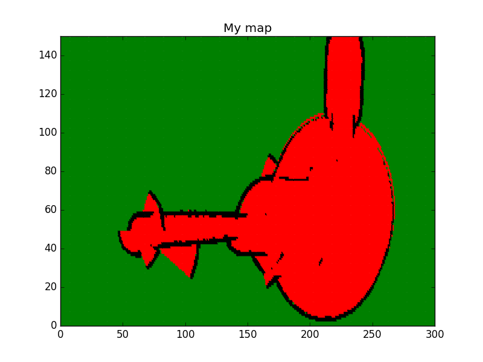

# Occupancy Grid Mapping Algo

### Compiling
```sh
$ cd /home/workspace/
$ git clone https://github.com/udacity/RoboND-OccupancyGridMappingAlgorithm
$ cd RoboND-OccupancyGridMappingAlgorithm/
$ rm -rf Images/* #Remove existing images from the folder
$ g++ main.cpp -o app -std=c++11 -I/usr/include/python2.7 -lpython2.7
```

### Running
```sh
$ ./app
```

Now, let the program generate the map!

### Generated Map



